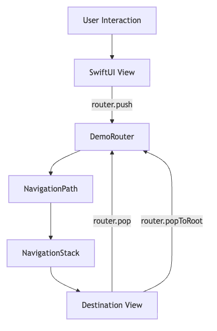

# 🚀 RouterDemo — SwiftUI Navigation Using Router Pattern


A clean, scalable **SwiftUI demo project** showcasing **centralized navigation** using the **Router Pattern** with `NavigationStack` and `NavigationPath`.

This approach avoids `NavigationLink` sprawl and enables **type-safe, programmatic, and testable navigation**, making it ideal for medium to large SwiftUI applications.

---

## ✨ Features

- ✅ Centralized navigation management
- ✅ Type-safe routing using `enum Route`
- ✅ Programmatic navigation (push / pop / popToRoot)
- ✅ Clean separation of UI & navigation logic
- ✅ Modern SwiftUI UI components
- ✅ iOS 16+ compatible

---

## 🧠 Architecture Overview

### 🔑 Core Components

| Component | Responsibility |
|----------|----------------|
| `Route` | Defines all possible navigation destinations |
| `DemoRouter` | Owns and mutates navigation state |
| `NavigationPath` | Stores navigation stack data |
| `NavigationStack` | Renders destination views |
| `Views` | UI only — no navigation logic |

---

## 🧭 Navigation Flow

```
User Action
    ↓
SwiftUI View
    ↓
DemoRouter (push / pop / popToRoot)
    ↓
NavigationPath updates
    ↓
NavigationStack renders destination
```

---

## 🏗 Architecture Diagram



> 💡 **Key Principle**  
> Views do not know *where* to navigate.  
> They only declare *what* route they want.

---

## 📂 Project Structure

```
RouterDemo
│
├── Router
│   ├── Route.swift
│   └── DemoRouter.swift
│
├── Views
│   ├── HomeView.swift
│   ├── ProfileView.swift
│   └── SettingsView.swift
│
├── RouterDemoAppApp.swift
└── README.md
```

---

## 🧪 Example Navigation Usage

```swift
router.push(.profile(userId: 101))
router.pop()
router.popToRoot()
```

✔ No `NavigationLink`  
✔ Fully programmatic  
✔ Easy to test and debug

---

## ❓ Why Router Pattern?

### ❌ Traditional SwiftUI Navigation Problems
- `NavigationLink` scattered across views
- Hard to support deep linking
- Poor scalability
- Tight coupling between screens

### ✅ Router Pattern Benefits
- Single source of truth
- Clean, predictable navigation flow
- Deep-link friendly
- UIKit-Coordinator-like control
- Scales well for large apps

---

## 🛠 Requirements

- **Xcode:** 14+
- **iOS:** 16+
- **Frameworks:** SwiftUI, Combine

---

## 📌 Best Practices Used

- `@MainActor` for UI-safe state updates
- `@StateObject` for router lifecycle management
- `@EnvironmentObject` for dependency injection
- Documentation comments (`///`)
- `MARK:` sections for readability
- Modular, reusable UI components

---

## 🚀 Possible Extensions

- 🔗 Deep-link handling
- 📱 Sheet & full-screen routing
- 🧭 Tab-based router
- 🧪 Unit tests for navigation flows
- 🧱 MVVM + Router architecture

---

## 📄 License

This project is provided for **learning and demonstration purposes**.  
You are free to adapt and extend it for your own projects.


